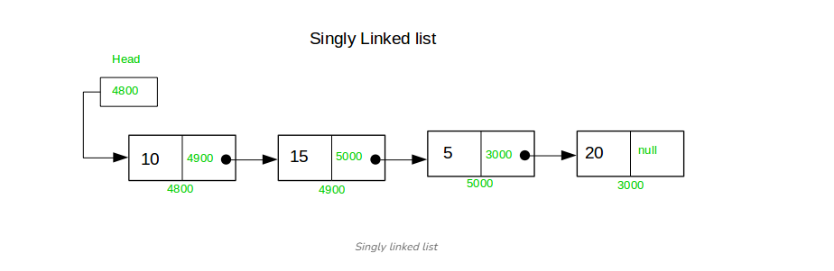

# 단일 연결리스트

각 노드가 연결리스트의 다음 노드를 가리키는 링크를 하나만 갖는 특수한 유형의 연결 리스트입니다.

#### 단일 연결리스트의 특성
- 각 노드는 하나의 값과 목록의 다음 노드에 대한 참조를 보유.
-  목록에는 목록의 첫 번째 노드에 대한 참조인 헤드가 있다. 헤드 노드를 사용하여 목록의 모든 항목에 액세스할 수 있다.
-  노드는 연속된 메모리 블록에 저장되지 않고, 대신 각 노드는 목록의 다음 노드 주소를 보유.
-  단일 연결리스트의 요소에 접근하려면 메모리의 특정 노드에 직접 접근할 수 없으므로 리스트의 헤드에서 원하는 노드까지 탐색해야한다.

