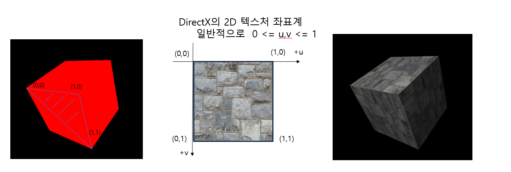
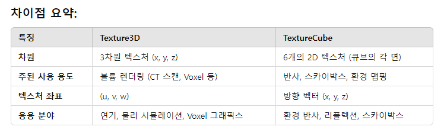

# Texture

## 텍스처 맵핑
메시의 삼각형에 이미지 자료를 입히는 기법. 이미지 자료는 텍스처에 저장되어 있으며
텍스처 좌표계의 좌표값으로 데이터를 가져오는 것을 `샘플링`이라고함.
데이터는 일반적인 색상 뿐만 아니라 다른 용도로 데이터를 텍스처에 저장하여 HLSL에서 응용한다.

Texture3D(3D 텍스처)
Texture3D는 3차원적인 텍스처로, 단일 텍스처에 여러 층(layer)이 있는 구조.
2D텍스처의 연속적인 배열로 볼 수 있으며, 이를 깊이(depth) 개념을 포함한 3D데이터를 저장할 수 있음.
##### 특징 :
  -  3D공간에서 텍스처 좌표가 (x,y,z)로 정의됨.
  -  각 좌표는 u,v,w와 같은 텍스처 좌표로 접근.

TextureCube(큐브 맵 텍스처)
TextureCube는 큐브 맵(Cube Map)텍스처로, 6개의 2D 텍스처가 하나의 3D 오브젝트의 면을 감싸는 형태로 사용됩니다. 
이 텍스처는 환경 맵핑이나 스카이박스에 주로 사용됨.

##### 특징 :
  -  6개의 텍스처가 각각의 면을 나타냄. (+X,-X,+Y,-Y,+Z,-Z)
  -  텍스처 좌표는 (u,v)로 표현되며, 3D공간에서는 방향 벡터(x,y,z)로 맵핑.
  - 주로 `환경 반사`나 `광원 효과`를 처리하는 데 사용됨. 예를 들어 거울 같은 표면에 주변 환경이 반사되는 모습을 표현.
  - 스카이박스: 3D 장면에서 하늘이나 배경을 표현할 때 큐브 맵 텍스처가 사용되어, 플레이어가 어느방향을 바라보든 매끄럽게 볼 수 있음.

## DDS(DirectDrawSurface) 포맷 특징
DirectX에서 2D 및 3D 텍스처를 저장하는데 사용됨. DDS는 텍스처를 압축된 상태로 저장할 수 있어 메모리 효율적이고, 빠른 로딩이 가능하며, 게임과 그래픽 프로그램으로 사용.

#### DDS포맷의 특징
  - 압축 가능:
    - DXT 압축 방식을 지원하여 텍스처 데이터를 압축하여 메모리 사용량을 줄이고, 성능을 높일 수 있음.
    - 압축 방식은 손실 압축이므로 파일 크기는 작아지지만, 약간의 품질 손실이 발생.

#### DDS포맷의 특징
  - Mipmap 지원:
    - DDS파일은 Mipmap을 포함할 수 있음. Mipmap은 테그처의 해상도를 여러 단계로 줄인 버전으로, 렌더링 시 멀리 있는 물체에 저해상도 텍스처를 사용함으로써 서능 최적화가 가능.
    - 텍스처의 여러 크기를 한번에 저장하여 GPU에서 빠르게 선택 가능.
    - Mipmap 자체저장(Texture LOD) : 낮은 해상도 Level을 Sampling 하면 Gpu 텍스처 캐시 히트율이 올라감.

## 객체 생성
ShaderResourceView : Direct3D자원(텍스처)를 쉐이더에 연결하여 사용할 때 필요한 객체
SamplerState : 쉐이더에서 텍스처를 샘플링하는 방법을 설정하는 객체.
