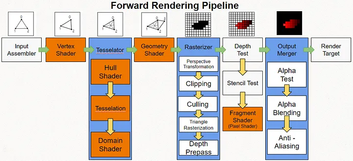

# 렌더링 파이프라인이란?
Direct3D11이 GPU에서 3D데이터를 최종 2D 프레임 이미지를 만드는 과정. 각 단계를 스테이지라고 하며 `이전 단계에서 전달받은 데이터`와 `스테이지에 설정한 데이터 또는 개체`와 함께 처리하여 다음단계로 전달.

## 1. IA : 입력 조립기(Input Assembler)
* 파이프 라인이 사용할 버텍스 데이터, 포맷, 그리는 방법을 설정하는 단계
* 3차원 모델 

## 2. VS : Vertex Shader
Model 좌표계 버텍스를 Matrix 곱셈하여 World Space -> Camera Space -> Clip Space(x,y,z,w) 좌표계 까지 변환하는 단계

## 3. Hull Shader / Tesselator / Domain Shader 
삼각형을 쪼개 추가적인 삼각형으로 만드는 단계 (생략 가능)

## 4. Gemotry Shader 
삼각형 단위에 추가 작업을 하는 단계(생략가능)

## 5. Resterizer 
좌표계를 Clip -> NDC -> Screen 변환 하며 삼각형 후면을 걸러 내고, 클리핑 영역으로 자르면서 깊이 값 있는 fragment(조각)을  만드는 단계

## 6. Pixel Shader
삼각형의 보간된 정보(주로 텍스처 u,v 좌표)와 스테이지에 설정된 다른 입력 정보(주로 텍스처)로 최종 픽셀을 결정하는 단계

## 7. Output Merger
픽셀을 깊이판정이나 스텐실 판정에 의해 폐기 또는 후면 버퍼에 기록하는 단계